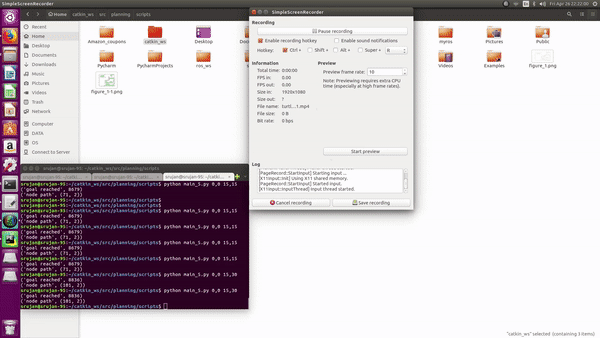

# Project - Differential Drive Robot with A* Path Planner

* This Project Implements A* Path Planning Algorithm for a differential drive robot.
* This Project is also simulated on Turtlebot 2 using ROS Gazebo
* The Project is implemented on real Turtlebot3 Robot at Robot Realization Laboratoy(RRL), University of Maryland, College Park

## Map of the environment 
The Following Map is used to plan the path

<em>Map of RRL Lab</em>

## Dependencies
following packages have to be imported for running this file 

* python 3.5 and above
* numpy
* math
* queue
* argparse
* matplotlib.pyplot

## Execution
The code is divided into four parts

`main.py`

`obstacle_space_offset.py`

`action_set_offset.py`

`publisher.py`

* The `main.py` imports the `action_set_offset.py` and `obstacle_space_offset.py` while it is being executed. The input for executing this needs to be given as following

`python main.py [start_position] [goal_position]`

* The sample imput for running `main.py` are given as below 

`python main.py 1,2 10,10`

`python main.py 0,0 15,30`  --> used for generating the video (this is generated for low rpm's, rpm1 = 2 and rpm2 = 3)

* It's good to take rpm1 = 5 and rpm2 = 4 for relatively efficient performance of the algorithm 
* After this program is executed, it will generate the `converted_velocities.txt` file which will be supplied to the ROS Gazebo.

* Now open a new terminal to initialize the roscore

* A ROS package has to be created. The package should have the launh file and the `rrl_map`. Instructions on how to create a package and write launch files can be found here : http://wiki.ros.org/ROS/Tutorials/CreatingPackage

* In my case the name of the package that I have created is planning. 

* Once, the package is successfully created, open a new terminal, launch the ROS gazebo using the following launch commands to load the `rrl_map` as following 

`ROBOT_INITIAL_POSE="-x [x coordinated of start position] -y [y coordinated of the start position]" roslaunch planning sru.launch`
This will spawn the turtlebot at the start position. 

note: the gazebo takes the spawn coordinated in meters, hence we need to give start_position divided by 10 which is my resolution

The sample command to launch the environment is 
`ROBOT_INITIAL_POSE="-x 0.1 -y 0.2" roslaunch planning sru.launch`

* Open a new terminal to run the publisher.py file as following 
`rosrun [package-name] publisher.py`

The sample command to start the node.`rosrun planning publisher.py`

## Results
The results are located in the `output/`

## See how it works

<em>TurtleBot 2 Simulated in Gazebo</em>

